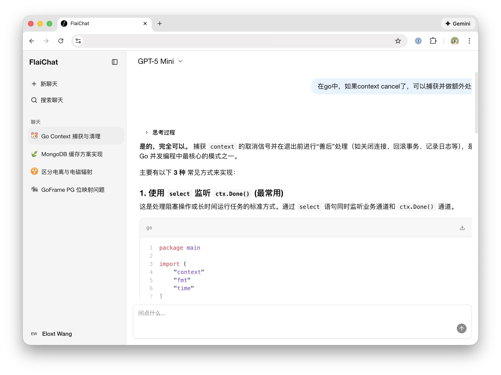

# Flai

A modern, AI-powered chat application designed for seamless interaction with multiple LLM providers.



## Features

- **Multi-Model Support**: Integrate with OpenAI, Google GenAI, and other major LLM providers.
- **User Authentication**: Secure signup and login flow with JWT-based session management.
- **Rich Chat Interface**:
    - Real-time streaming responses.
    - Markdown rendering for code and formatted text.
    - Conversation history management.
    - Dark/Light mode support.
- **Responsive Design**: Mobile-friendly layout built with modern UI components.
- **Internationalization (i18n)**: Ready for multi-language support.

## Tech Stack

### Frontend
- **Framework**: React 19 (via Vite)
- **Routing**: React Router 7
- **Styling**: TailwindCSS v4, Shadcn/UI (Radix UI), Base UI
- **State Management**: Zustand
- **Icons**: Lucide React

### Backend
- **Language**: Go 1.24
- **Framework**: GoFrame (GF) v2
- **Database**: PostgreSQL (pgx driver)
- **Authentication**: JWT (golang-jwt)
- **AI Integration**:
    - `openai-go`
    - `google.golang.org/genai`

## Project Structure

- `frontend/`: React application source code.
    - `app/`: Main application logic, components, and pages.
    - `public/`: Static assets.
- `internal/`: Go backend application logic.
    - `controller/`: Request handlers (API endpoints).
    - `service/`: Business logic.
    - `dao/`: Data Access Objects.
    - `model/`: Data models.
- `api/`: API definitions and schemas.
- `hack/`: Build scripts and tooling.

## Getting Started

### Prerequisites

- Go 1.24+
- Node.js & pnpm
- PostgreSQL
- Docker (optional)

### Running Locally

1. **Backend**:
    ```bash
    # Check Makefile for specific commands
    make run
    ```

2. **Frontend**:
    ```bash
    cd frontend
    pnpm install
    pnpm dev
    ```

## License

GPL-3.0